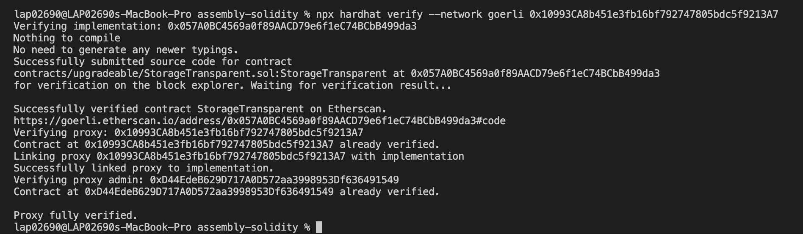
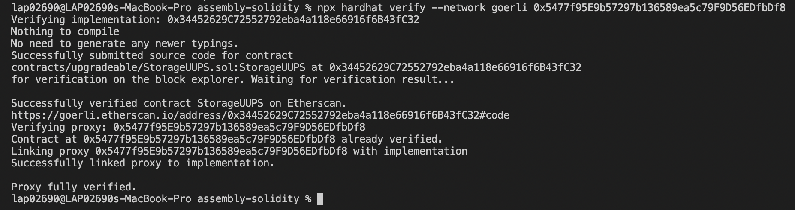

# Learn Solidity Language

## Upgradeable

`Deploy StorageTransparent:`

- Deployer: 0x7500d14588Aca06855b635B30D360C29575A8F27
- When deploy, 2 tx:

  1. Tx1: create contract 0x057A0BC4569a0f89AACD79e6f1eC74BCbB499da3: implemetation
  2. Tx2: create contract 0x10993CA8b451e3fb16bf792747805bdc5f9213A7: proxy address. Proxy contract call Implementation contract to do initialize function

- The address returned: 0x10993CA8b451e3fb16bf792747805bdc5f9213A7
- Verify contract, we found proxy admin: 0xD44EdeB629D717A0D572aa3998953Df636491549. Call it functions:
  - getProxyAdmin(0x10993CA8b451e3fb16bf792747805bdc5f9213A7) => 0xD44EdeB629D717A0D572aa3998953Df636491549
  - getProxyImplementation(0x10993CA8b451e3fb16bf792747805bdc5f9213A7) => 0x057A0BC4569a0f89AACD79e6f1eC74BCbB499da3
  - owner: 0x7500d14588Aca06855b635B30D360C29575A8F27

After verifying: only implementation verified, proxy contract did not

`Upgrade StorageTransparent:`

- Call 2 tx:
  1. Deploy new implementation contract at 0x4A40AF81437fDF812fF4c88f01447f9281e3dE39
  2. Call **upgrade** of proxyAdmin to update implementation address of Proxy contract

`Deploy StorageUUPS:`

- Deployer: 0x7500d14588Aca06855b635B30D360C29575A8F27
- When deploy, 2 tx:

  1. Tx1: create contract 0x34452629C72552792eba4a118e66916f6B43fC32: implemetation
  2. Tx2: create contract 0x5477f95E9b57297b136589ea5c79F9D56EDfbDf8: proxy address.

- Verify contract

`Upgrade StorageUUPS:`

- Call 2 tx:
  1. Deploy new implementation contract at 0xBC952cb995a7307c94b59D8a2306fcE2e838383d
  2. Call **upgradeTo** of Proxy to update implementation address of Proxy contract
